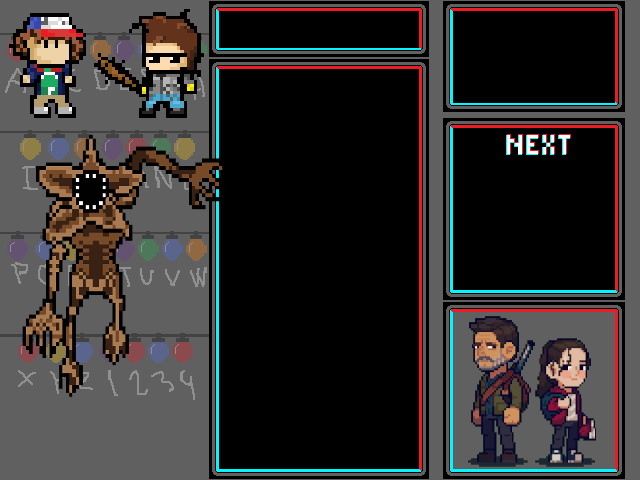
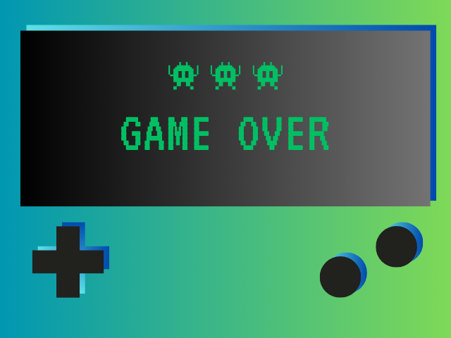

# Projecte pygame

En aquest projecte farem un tetris. 
-----------------------------------------------------------------------------------------------------------------------------------------------------------------------------------------------------
## - Piezas Tetris 

## - Bombillas

## - Luciérnaga

## - Botones

## - Fondo Juego

## - Game Over

